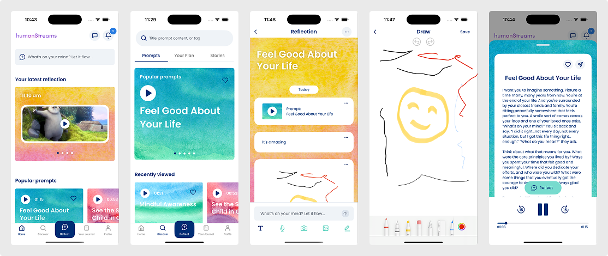
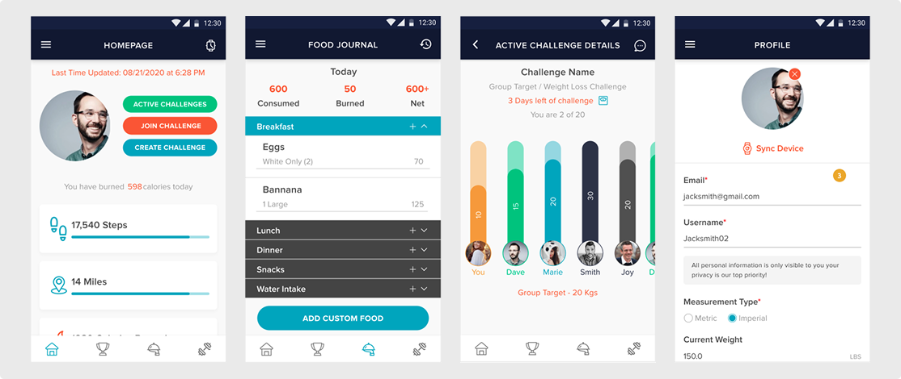
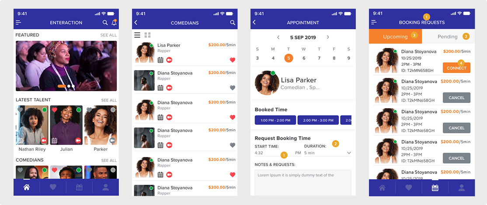

  

# Hi 👋, I'm Rajinderpal Singh

### A passionate developer from India, Punjab

# 🚀 About Me

Experienced and highly motivated Mobile App Developer with over 7 years of professional
 experience in iOS development and recent hands-on experience with Flutter for
 cross-platform mobile applications. Proficient in Swift, SwiftUI, and Flutter (Dart) with a
 deep understanding of UI/UX design principles, reusable architecture patterns (MVC,
 MVVM), third-party SDK integration, push notifications, and in-app purchases (IAP). Proven
 ability to independently handle end-to-end app development for both iOS and Android
 platforms. Strong background in App Store submission, sprint planning, API integration,
 and mentoring junior developers. Trusted for delivering pixel-perfect UI, high-quality
 code, and strong ownership of tasks.

# 🚀 Projects

## HumanStreams – A Guided Journaling & Reflection App

An iOS app designed to help users reflect deeply through prompts, voice journaling, drawings, and AI-guided conversations. I worked as the lead developer, building core features such as journaling flows, audio playback, media capture, and custom UI components.

### Features
- **Reccomended Prompts**: Choose prompts that speak to you or let us offer recommendations based on your mental health goals.
- **Read and Listen Prompts**: You can read and listen the prompts and can also use prompt to create your reflection.
- **Different ways to reflect**: You can reflect in many ways in the form of Text, Audio recording, video, images, drawing bubbles.
- **Share Reflections**: You can also securely share a reflection with someone close to you, sparking conversation and bringing you closer together..

**Tech Stack:**

- UIKit
- Swift
- Core Data
- AVKit
- Offline functionality
- Alamofire for RESTApi
- Drawing board (PencilKit) functionality
- Speech framework for Real time Speech to Text
- Concurent data uploading
- User's personal data encryption
- Crashlytics, and Push Notifications

## Complete2Beat – Weight Loss App

An iOS app designed to help users Lose weight and become fit. This app includes Challenge for friends and family to get healthier together in a fun and competitive way. It has steps and calories tracking feature syncing data from Apple health App or Fitbit. Other features include food intake logs, barcode scanner.

### Features
- **Activity tracker**: Sync Compete2Beat with your activity device or manually enter activity to participate in the C2B Steps challenge.
- **Calorie Counter**: Keep track of your calories to lose weight swiftly. Use the built-in barcode scanner to input the calorie intake of the different foods you eat.
- **Other Features**: Option to keep your health profile private or make it public, Invite your friends/family, Create a public or private challenge.

**Tech Stack:**

- UIKit
- Swift
- Apple health Data sync
- AVKit
- Offline functionality
- URL Session for RESTApi
- Core Data
- Crashlytics, and Push Notifications

## Enteraction

Enteraction is an app to connect celebrities through video, which is what we call Enteraction. Users can request to schedule a live phone call with their favorite personalities for that ultimate fan experience.

### Features
- **Booking Functionality**: Book video call meeting with a celebrity.
- **Payments**: Stripe payments.
- **Video callings**: Video calling functionality using Agora.
- **WebSockets**: Web Sockets for events handling like incoming call, call disconnect etc.

**Tech Stack:**

- UIKit
- Swift
- AgoraRCT for video calling
- Websockets
- URL Session for RESTApi
- Crashlytics, and Push Notifications

# 💼 Work Experience

### Sr. iOS Developer at OffsureIT Solutions (oct 2017 to sep 2025)
*Mohali*

7+ years building and maintaining iOS & Flutter apps, delivering scalable, high-performance solutions.

Experienced in Swift, SwiftUI, Flutter, AWS, APIs, in-app purchases, Core Data, push notifications, analytics integration, App store submission and other stuff, handling certificates/profiles and other developer account stuff.

## 🌐 Connect with Me

**Thank you for visiting my profile! 😊**

